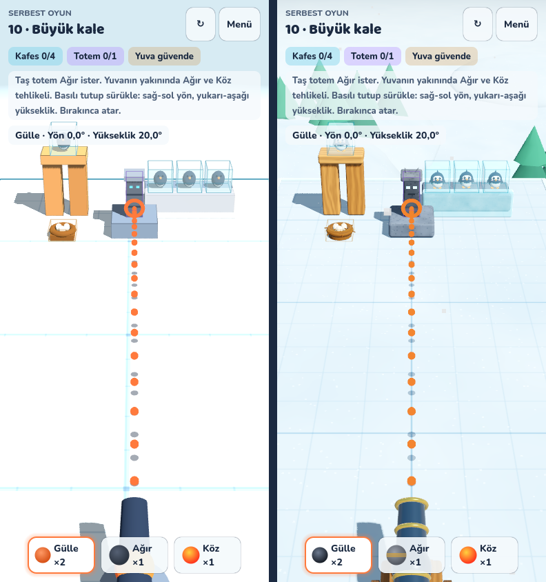

# Buzkıran Vadisi

Buza hapsolmuş yavruları kurtardığın, kısa oturumlu, fizik tabanlı bir mobil bulmaca oyunu.
Hedef platform **iPhone**; oyun **Godot 4.7.2** ve **Rapier** fizik motoruyla yapılıyor.

Şu anki durum **M1.1: ilk görsel geçiş**. Web prototipinin (v4.1) 10 bölümünün Godot'daki
karşılığı; oynanış ve bölümler aynı. Görünüm "buzdan oyuncak diorama" yönünde:
yuvarlak kenarlı bloklar, ahşap/taş/buz dokuları, yavru penguenler, tekerlekli top arabası, vadide çam
ormanı ve yağan kar. Görseller kodla üretilmiş şekiller; son sanat, meta, reklam ve satın alma yok.

## Klasörler

| Klasör | İçerik |
|---|---|
| `oyun/` | Godot projesi, yani asıl mobil oyun |
| `oyun/sim/` | Deterministik fizik çekirdeği: `sim.gd`, `levels.gd`, `config.gd`, `detmath.gd`, `referans.gd` |
| `oyun/gorunum/` | 3D sahne (`sahne.gd`), yuvarlak kutu ve diğer şekiller (`sekiller.gd`), doku shader'ları (`malzemeler.gd`), karakterler ve top (`karakterler.gd`), vadi manzarası (`cevre.gd`) |
| `oyun/arayuz/` | Ekranlar, göstergeler (HUD) ve mermi çubuğu |
| `oyun/ses/` | Geçici sesler (WAV) ve titreşim |
| `oyun/araclar/` | Test botu, referans, ses ve simge üreticileri |
| `oyun/testler/` | Uçtan uca test, web ile karşılaştırma, ekran görüntüsü |
| `docs/iphone-kurulum.md` | Mac ile iPhone'a kurulum, adım adım |
| `prototip-web/` | Önceki web prototipi (v3, v4, v4.1). Artık geliştirilmiyor, yalnızca referans. |

## iPhone'a kurmak

[docs/iphone-kurulum.md](docs/iphone-kurulum.md) dosyasına bak. Mac, Xcode ve bir Apple kimliği yeterli.

## Testler (bulutta, görüntüsüz)

`godot` komutu, Godot 4.7.2'nin Linux sürümünü ifade ediyor.

| Komut (oyun/ klasöründe) | Ne yapar |
|---|---|
| `godot --headless -s res://araclar/bot.gd -- --coarse --out=bot.json` | Her bölümde ve her mermiyle ilk atış ızgarasını tarar. Yön −15…+15°, yükseklik 5…70°, `--coarse` ile 2° adım, yoksa 1°. Tek atışta çözüm yoksa ışın aramasıyla (beam search; genişlik 3, sonraki atışlar 3° adım) çok atışlı çözüm arar. `--need` seçeneği "Ağır ya da Köz olmadan da çözülüyor mu?" diye kontrol eder. |
| `godot --headless -s res://araclar/referans_uret.gd -- bot.json` | Botun çözümlerinden tutarlılık testinin referansını (`sim/referans.gd`) üretir. |
| `xvfb-run godot --rendering-driver opengl3 --resolution 390x844 -s res://testler/e2e.gd -- <klasör>` | Oyunu gerçek görüntüyle oynar. Her bölümün ekran görüntüsünü alır ve hedef görünürlüğünü ölçer. Tam turu, iki kaybetme yolunu ve kaybedince çıkan ipucunu dener, uygulama içi tutarlılık testini çalıştırır. |
| `godot --headless -s res://testler/web_karsilastir.gd -- web_grid.json` | Aynı atışlarda web prototipi ile Godot'nun sonuçlarını karşılaştırır. |

**Botun sınırı:** Bot yalnızca taranan sınırlar ve adım büyüklüğü içinde çözüm olup olmadığını ölçer.
Oyuncunun çözümü bulacağını, anlayacağını ya da eğleneceğini göstermez. "Bulunamadı" demek "imkânsız" demek değildir.

## Tutarlılık (determinizm)

Aynı bölüm ve aynı sayısal atış girdisi her cihazda aynı sonucu vermeli. Bu koşullara bağlı:

- **Fizik uzayı elle adımlanır:** sabit 1/60 saniye. Kare hızı sonucu etkilemez, atışlar arasında dünya donar.
- **Cisimler her zaman aynı sırayla oluşturulur.**
- **Atış girdisi iki tam sayıdır** (derecenin onda biri). Açı hesabında motorun `sin`/`cos` fonksiyonları kullanılmaz.
- **Kararlar yalnızca GDScript'teki basit çift duyarlıklı işlemlerle verilir.** Motorun vektör fonksiyonları kullanılmaz, çünkü bazı işlemciler çarpma ve toplamayı tek adımda (FMA) yapıp farklı sonuç verebilir.
- **Rapier eklentisi cihazlar arası tutarlı çalışacak şekilde derlenmiştir.** Eklentinin kendi testleri Linux, macOS ve Windows'ta aynı sonucu gösteriyor.

iPhone'da durumun ne olduğunu oyundaki **Tutarlılık testi** gösterir; bu henüz ölçülmedi.
Tutarlılık adalet ya da eğlence kanıtı da değildir.

## Web prototipinden farklar

- Godot'daki Rapier eklentisi sürtünmeyi en küçük değerle, sekmeyi toplamla birleştiriyor; web ise ortalama alıyordu.
  Malzeme değerleri buna göre ayarlandı (`sim/config.gd`).
- **Web ile karşılaştırma:** 10 bölüm, her mermi türü, 2°'lik ızgara, toplam 8.976 atış.
  - Kazanma sonucu her bölümde ve her mermi türünde en az %98 aynı.
  - Kırılan kafes, devrilen totem ve yuva dahil tüm sonuç en az %96 aynı.
- Web'deki değerlendirme formu kaldırıldı. Yerine tur sonu özeti ve bölüm ilerlemesinin kaydı geldi.
- iPhone'da titreşim çalışıyor; web'de çalışmıyordu.

## Bu sürüm neyi kanıtlamaz

- pazar talebi;
- reklam geliri;
- son sanat kalitesi;
- son performans.

Görseller kodla üretildi; son sanat için bir sanatçı ya da model paketi gerekecek. Performans henüz
gerçek bir iPhone'da ölçülmedi. Bu ortamdaki ölçüme göre en kalabalık bölümde (B10) çizim çağrısı 138'den
165'e çıktı.
